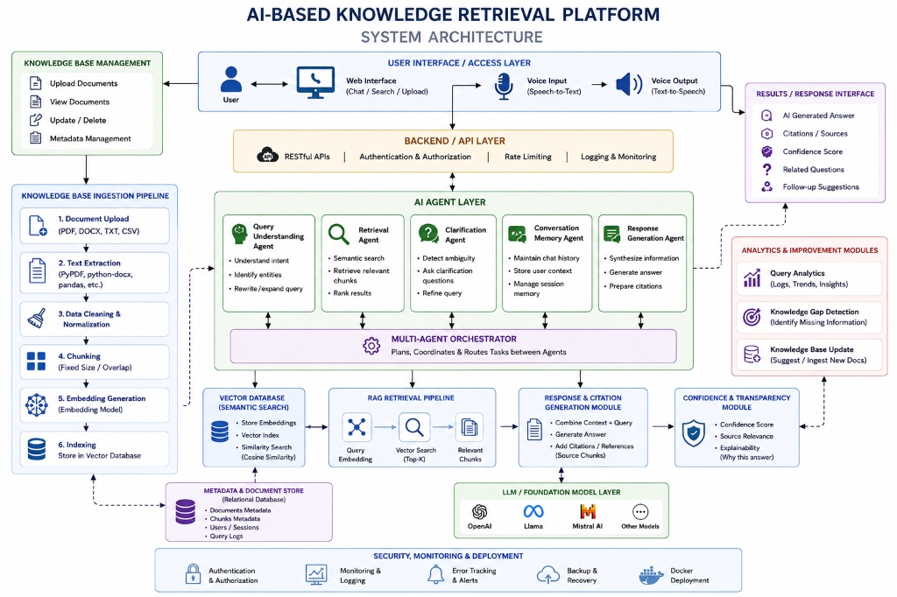

# AI-Based Knowledge Retrieval Platform with Query Resolution System

**Internship Project — Milestone 1**
**Date:** 28 August 2026
**Author:** G. Adarsh

---

## 1. Project Overview

Organisations accumulate large volumes of internal documents — HR policies, technical guides, compliance manuals, training materials — that employees need to query regularly. Searching these documents using keyword search is slow and imprecise. Asking a general-purpose LLM produces unreliable answers because the model has no access to private, domain-specific content.

This platform solves the problem by building a **Retrieval-Augmented Generation (RAG)** system that:

1. Ingests private documents in multiple formats (PDF, DOCX, TXT, CSV).
2. Converts them into searchable semantic embeddings stored in a vector database.
3. When a user asks a question, retrieves the most relevant document chunks.
4. Passes the retrieved context to an LLM to generate a grounded, cited answer.

A five-agent architecture handles query understanding, retrieval, response generation, clarification, and conversation memory.

---

## 2. Objective

To develop a complete AI-based knowledge retrieval platform that enables employees to query internal knowledge bases using natural language, receive accurate and cited answers, and interact through text and eventually voice.

The platform must:
- Support multiple document formats.
- Avoid hallucination by grounding answers in retrieved content.
- Be modular and extensible across a 4–5 month development timeline.
- Include a multi-agent pipeline for intelligent query resolution.

---

## 3. Milestone 1 Scope

| Area | Description |
|---|---|
| M1.1 Research | RAG, embeddings, chunking, vector search, agents, Web Speech API |
| M1.2 Architecture | System design, component description, data flows |
| M1.3 Ingestion | PDF/DOCX/TXT/CSV extraction, cleaning, chunking, embedding, indexing |
| M1.4 Validation | Test domains, query types, evaluation framework |

---

## 4. System Architecture



The architecture diagram above shows the complete planned platform. The components shaded in the AI Agent Layer, Vector Database, RAG Pipeline, and Backend API are implemented in Milestone 1. Voice I/O, Analytics, and Security modules are planned for later milestones.

---

## 5. RAG Pipeline

```
Document (PDF / DOCX / TXT / CSV)
        ↓
    Text Extraction
        ↓
 Cleaning / Normalization
        ↓
  Chunking (500 tokens, 50 overlap)
        ↓
 Embedding Generation (text-embedding-3-small)
        ↓
  Vector Store (ChromaDB, cosine similarity)
        ↓
     (User Query)
        ↓
  Query Embedding
        ↓
  Similarity Search (Top-K)
        ↓
  Relevant Chunks Retrieved
        ↓
  Context + Query → LLM Prompt (GPT-4o-mini)
        ↓
  Grounded Answer + Source Citations
```

---

## 6. Multi-Agent Architecture

```
                        ORCHESTRATOR
                             |
       +---------------------+---------------------+
       |                     |                     |
       ↓                     ↓                     ↓
Query Understanding     Retrieval Agent       Clarification Agent
Agent                        |                     |
(intent, key terms)    (embed + vector search) (detect ambiguity)
       |                     |                     |
       +---------------------+---------------------+
                             |
                             ↓
                  Response Generation Agent
                   (context + LLM → answer)
                             |
                  Conversation Memory Agent
                   (store + provide history)
```

### Agent Responsibilities

| Agent | Role |
|---|---|
| **Query Understanding Agent** | Detects intent (factual/procedural/comparative/definitional), extracts key terms, normalises phrasing, determines if retrieval is needed |
| **Retrieval Agent** | Converts query to embedding, queries ChromaDB, returns Top-K chunks ranked by cosine similarity |
| **Response Generation Agent** | Combines retrieved chunks with query, calls LLM, prepares answer and source citations |
| **Clarification Agent** | Detects ambiguous queries (pronouns, short queries), returns a clarification question before retrieval |
| **Conversation Memory Agent** | Stores conversation history (rolling 10-message window), resolves pronoun references from prior context |

---

## 7. Supported Document Formats

| Format | Library | Status |
|---|---|---|
| PDF | pypdf | Implemented |
| DOCX | python-docx | Implemented |
| TXT | Python built-in | Implemented |
| CSV | pandas | Implemented |

---

## 8. Data Models

Full schema definitions for all seven data models are in [`docs/M1_Data_Models_and_Schemas.md`](docs/M1_Data_Models_and_Schemas.md).

| Schema | Description |
|---|---|
| Document | Uploaded document record |
| Chunk | Text segment from chunking |
| Embedding | Vector representation of a chunk |
| Query | User query with intent metadata |
| Retrieval Result | Single chunk returned by search |
| Response | LLM-generated answer with citations |
| Conversation Memory | Stored chat turn |

---

## 9. Technology Stack

| Layer | Technology |
|---|---|
| Web Framework | FastAPI |
| Embedding Model | OpenAI text-embedding-3-small |
| LLM | OpenAI GPT-4o-mini |
| Vector Database | ChromaDB (persistent, local) |
| PDF Extraction | pypdf |
| DOCX Extraction | python-docx |
| CSV Processing | pandas |
| Token Counting | tiktoken (cl100k_base) |
| Settings / Config | pydantic-settings, python-dotenv |
| Testing | pytest |
| Runtime | Python 3.11+ |

---

## 10. Milestone 1 Implementation Status

| Component | Status |
|---|---|
| M1.1 Research & Documentation | ✅ Completed |
| M1.2 System Architecture | ✅ Completed |
| M1.3 Data Models | ✅ Completed |
| PDF ingestion | ✅ Implemented |
| DOCX ingestion | ✅ Implemented |
| TXT ingestion | ✅ Implemented |
| CSV ingestion | ✅ Implemented |
| Text cleaning / normalisation | ✅ Implemented |
| Token-based chunking (configurable) | ✅ Implemented |
| Embedding generation (OpenAI) | ✅ Implemented (requires API key) |
| ChromaDB vector store | ✅ Implemented |
| Semantic retrieval (Top-K) | ✅ Implemented |
| Basic RAG pipeline | ✅ Implemented |
| FastAPI backend + endpoints | ✅ Implemented |
| Query Understanding Agent | ✅ Implemented |
| Retrieval Agent | ✅ Implemented |
| Response Generation Agent | ✅ Implemented |
| Clarification Agent | ✅ Implemented |
| Conversation Memory Agent | ✅ Implemented |
| Unit tests (ingestion, chunking, agents) | ✅ Implemented |
| Sample documents (HR + Technology) | ✅ Provided |
| M1.4 Retrieval Validation Framework | ✅ Defined (results pending API key) |
| Multi-Agent Orchestrator (standalone) | 🔄 Planned — Milestone 2 |
| Web UI (Chat interface) | 🔄 Planned — Milestone 2 |
| Voice Input / Speech-to-Text | 🔄 Planned — Milestone 3 |
| Text-to-Speech output | 🔄 Planned — Milestone 3 |
| Authentication & Authorisation | 🔄 Planned — Milestone 3 |
| Confidence scoring | 🔄 Planned — Milestone 3 |
| Knowledge-gap detection | 🔄 Planned — Milestone 4 |
| Query analytics | 🔄 Planned — Milestone 4 |
| Docker deployment | 🔄 Planned — Milestone 4 |

---

## 11. Retrieval Validation

Two test domains with four query types are used for evaluation:

| Domain | Documents | Query Types |
|---|---|---|
| HR | employee_handbook.txt, leave_policy.txt | Factual, Procedural, Unavailable |
| Technology | cloud_security.txt, network_security.txt | Factual, Procedural, Comparative |

**Evaluation metrics:** Top-1, Top-3, Top-5 Accuracy (Recall@K)

**Hallucination test:** Query 3 ("What is the company's retirement age?") verifies the system refuses to answer when information is not in the knowledge base.

Full details: [`docs/M1_Retrieval_Validation.md`](docs/M1_Retrieval_Validation.md)

---

## 12. Project Structure

```
AI-Based-Knowledge-Retrieval-Platform/
├── README.md
├── .gitignore
├── requirements.txt
├── .env.example
├── docs/
│   ├── System_Architecture.png
│   ├── M1_Research_and_Technical_Understanding.md
│   ├── M1_System_Architecture.md
│   ├── M1_Data_Models_and_Schemas.md
│   └── M1_Retrieval_Validation.md
├── config/
│   ├── __init__.py
│   └── settings.py
├── ingestion/
│   ├── __init__.py
│   ├── document_loader.py
│   ├── pdf_loader.py
│   ├── docx_loader.py
│   ├── txt_loader.py
│   ├── csv_loader.py
│   ├── text_cleaner.py
│   ├── chunking.py
│   └── embeddings.py
├── retrieval/
│   ├── __init__.py
│   ├── vector_store.py
│   ├── retriever.py
│   └── rag_pipeline.py
├── agents/
│   ├── __init__.py
│   ├── query_understanding_agent.py
│   ├── retrieval_agent.py
│   ├── response_generation_agent.py
│   ├── clarification_agent.py
│   └── conversation_memory_agent.py
├── backend/
│   ├── __init__.py
│   ├── main.py
│   ├── api/
│   │   ├── __init__.py
│   │   └── routes/
│   │       ├── __init__.py
│   │       ├── health.py
│   │       ├── ingest.py
│   │       └── query.py
│   ├── models/
│   │   ├── __init__.py
│   │   └── schemas.py
│   └── services/
│       ├── __init__.py
│       └── ingestion_service.py
├── data/
│   └── sample_documents/
│       ├── hr/
│       │   ├── employee_handbook.txt
│       │   └── leave_policy.txt
│       └── technology/
│           ├── cloud_security.txt
│           └── network_security.txt
└── tests/
    ├── __init__.py
    ├── test_ingestion.py
    ├── test_chunking.py
    └── test_retrieval.py
```

---

## 13. Setup and Running

### Prerequisites

- Python 3.11+
- OpenAI API key (required for embeddings and LLM)

### Installation

```bash
git clone https://github.com/AdarshGaddameedi25/AI-Based-Knowledge-Retrieval-Platform-with-Query-Resolution-System.git
cd AI-Based-Knowledge-Retrieval-Platform-with-Query-Resolution-System
pip install -r requirements.txt
cp .env.example .env
```

Edit `.env` and set your `OPENAI_API_KEY`.

### Run the API Server

```bash
python backend/main.py
```

API available at: `http://localhost:8000`
Interactive docs: `http://localhost:8000/docs`

### Ingest Sample Documents

```bash
python -c "
from backend.services.ingestion_service import IngestionService
svc = IngestionService()
results = svc.ingest_directory('data/sample_documents')
for r in results:
    print(r)
"
```

### Run Tests

```bash
pytest tests/ -v
```

Note: Tests for ingestion and chunking run without an API key. Tests requiring the retrieval pipeline and LLM require a valid `OPENAI_API_KEY`.

---

## 14. Important Notes

- **Do not commit `.env`** — it is excluded by `.gitignore`.
- Embeddings and LLM calls require a valid `OPENAI_API_KEY`. Without it, the ingestion and query endpoints return a `503` error.
- Text cleaning, chunking, and the Query Understanding / Clarification / Conversation Memory agents work fully offline without an API key.
- The vector store persists locally at `./data/vector_store` (excluded from git).

---

## 15. Future Milestones

| Milestone | Planned Features |
|---|---|
| Milestone 2 | Standalone multi-agent orchestrator, web chat UI, conversation flow |
| Milestone 3 | Voice I/O (Web Speech API), authentication, confidence scoring |
| Milestone 4 | Knowledge-gap detection, query analytics, knowledge base updates |
| Milestone 5 | Docker deployment, security hardening, production readiness |

---

## Documentation

| Document | Link |
|---|---|
| Research & Technical Understanding | [M1_Research_and_Technical_Understanding.md](docs/M1_Research_and_Technical_Understanding.md) |
| System Architecture | [M1_System_Architecture.md](docs/M1_System_Architecture.md) |
| Data Models & Schemas | [M1_Data_Models_and_Schemas.md](docs/M1_Data_Models_and_Schemas.md) |
| Retrieval Validation | [M1_Retrieval_Validation.md](docs/M1_Retrieval_Validation.md) |
